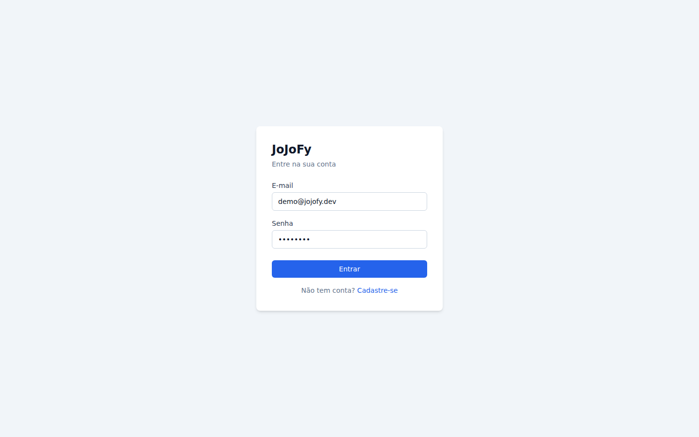
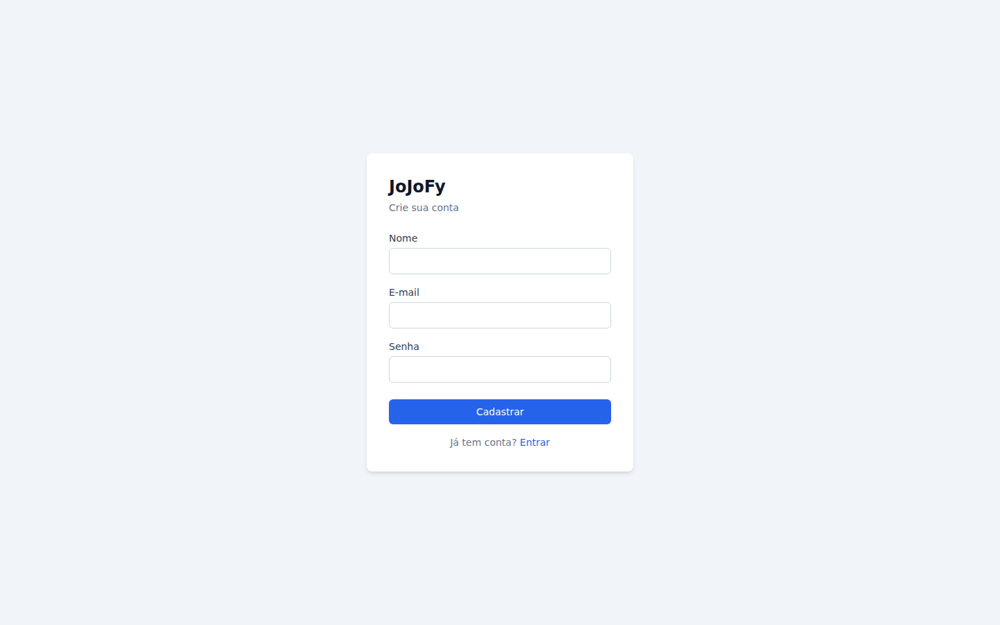
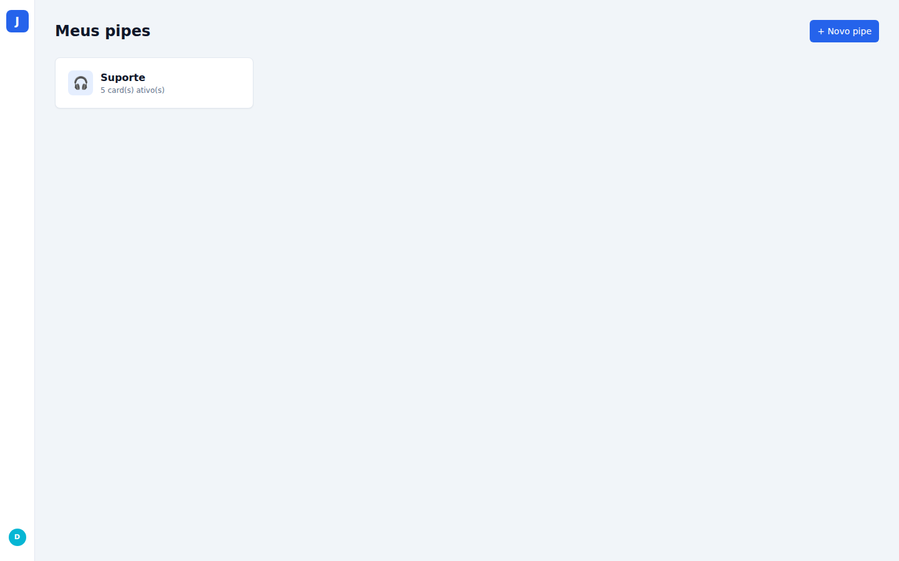
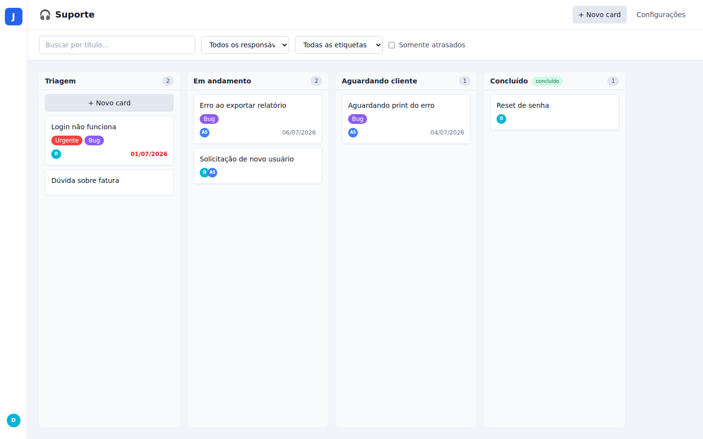
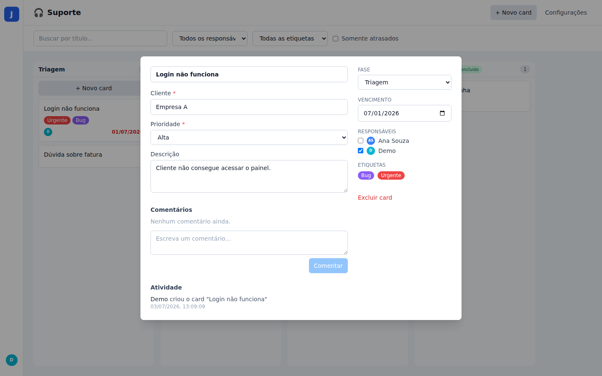
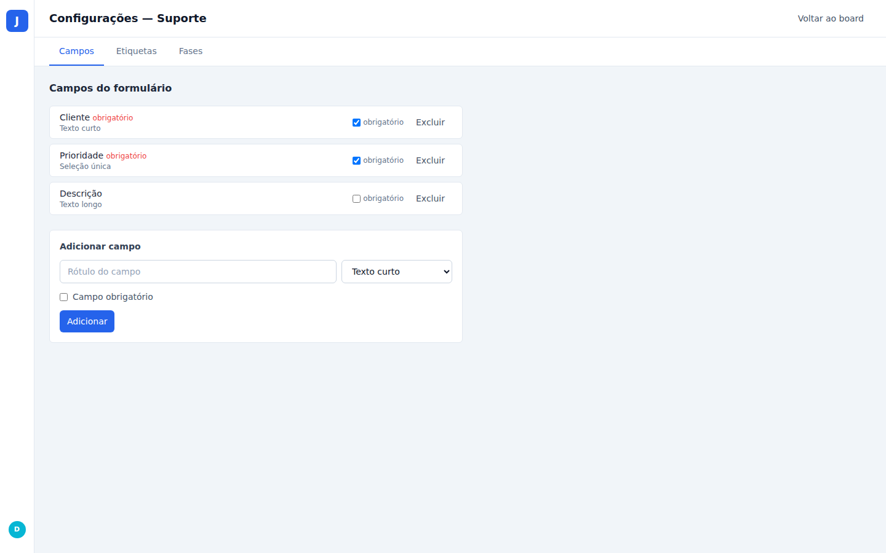

# JoJoFy

Clone do Pipefy — gestão de processos em Kanban. MVP com autenticação, pipes
com fases configuráveis, campos personalizados, cards com drag & drop,
responsáveis, etiquetas, comentários e histórico de atividades.

Consulte `docs/FUNCIONALIDADES.md` para a especificação funcional completa e
`docs/PLANO_IMPLEMENTACAO.md` para o plano de implementação do MVP executado
neste repositório.

## Stack

- **Servidor** (`server/`): Node.js 20 + Fastify + TypeScript + Prisma + SQLite.
- **Frontend** (`web/`): React 18 + TypeScript + Vite + TailwindCSS + dnd-kit
  + React Router + TanStack Query.
- **Testes**: Vitest (rotas do servidor via `fastify.inject`; lógica de UI e
  reducer do board no frontend).
- Monorepo gerenciado com **npm workspaces**.

## Requisitos

- Node.js 20+ (ou compatível) e npm 10+.

## Setup

```bash
npm install
```

Os arquivos `server/.env` e `server/.env.test` já vêm configurados com valores
de desenvolvimento (`DATABASE_URL`, `JWT_SECRET`), então nenhuma configuração
adicional é necessária para rodar localmente.

A migration inicial já está versionada em `server/prisma/migrations`. Aplique-a
para criar o arquivo `server/prisma/dev.db` na primeira vez (isso também roda
`prisma generate`):

```bash
npm run prisma:deploy -w server
```

Popule o banco com dados de demonstração:

```bash
npm run db:seed
```

Isso cria:
- Usuário demo: **demo@jojofy.dev** / **demo1234**
- Usuário adicional: **ana@jojofy.dev** / **demo1234**
- Pipe "Suporte" com 4 fases, 3 campos, 2 etiquetas e 6 cards de exemplo.

## Rodando em desenvolvimento

```bash
npm run dev
```

Sobe os dois serviços em paralelo (via `concurrently`):
- API em `http://localhost:3333` (rotas em `/api/...`)
- Frontend em `http://localhost:5173` (proxy `/api` → `:3333` configurado no Vite)

Acesse `http://localhost:5173/login` e entre com `demo@jojofy.dev` / `demo1234`.

## Testes

```bash
npm test
```

Roda os testes dos dois workspaces (`vitest run`). No servidor, os testes
sobem uma instância do Fastify via `fastify.inject` contra um banco SQLite de
teste isolado (`server/prisma/test.db`, criado/sincronizado automaticamente
pelo `globalSetup` do Vitest) e limpam as tabelas entre casos de teste. No
frontend, os testes cobrem a lógica pura de reordenação do board e o
roteamento protegido da aplicação.

## Build de produção

```bash
npm run build
```

Compila o servidor (`tsc`) para `server/dist` e o frontend (`tsc -b && vite
build`) para `web/dist`.

## Estrutura do projeto

```
JoJoFy/
├── docs/                        # especificação e plano de implementação
├── server/
│   ├── prisma/
│   │   ├── schema.prisma        # modelo de dados
│   │   ├── migrations/
│   │   └── seed.ts              # dados de demonstração
│   └── src/
│       ├── app.ts                # build do Fastify (usado nos testes)
│       ├── index.ts              # entrypoint (listen)
│       ├── plugins/auth.ts       # plugin de JWT + hook de autenticação
│       ├── routes/               # auth, users, pipes, phases, fields, labels, cards, comments
│       ├── lib/                  # prisma client, erros HTTP, activity log, validação de campos
│       └── test/                 # setup do Vitest e testes de rota
└── web/
    └── src/
        ├── api/                  # cliente HTTP + hooks do TanStack Query
        ├── auth/                 # contexto de sessão (JWT em localStorage)
        ├── board/                # lógica pura de reordenação (testada)
        ├── components/
        │   ├── ui/                # Button, Input, Select, Modal, Avatar, Chip...
        │   ├── board/             # colunas, cards, filtros, modal de novo card
        │   ├── card/              # CardModal, comentários, timeline de atividade
        │   └── settings/          # abas de configuração do pipe
        └── pages/                 # Login, Register, Home, PipeBoard, PipeSettings
```

## Funcionalidades do MVP

- **Autenticação**: registro/login com e-mail e senha, sessão via JWT
  armazenado no `localStorage`.
- **Pipes**: criação (com 3 fases padrão), renomeação, exclusão.
- **Fases**: criar, renomear, reordenar, marcar como "concluído"/"cancelado";
  exclusão bloqueada quando a fase possui cards (`409`).
- **Campos personalizados**: texto curto, texto longo, número, data, seleção
  única (com opções) e e-mail; podem ser marcados como obrigatórios.
- **Cards**: criados pelo formulário inicial (valida campos obrigatórios),
  movidos por drag & drop entre/dentro das fases (dnd-kit) com atualização
  otimista e persistência via `POST /cards/:id/move`.
- **Responsáveis, etiquetas e vencimento**: atribuídos/editados no CardModal;
  cards atrasados são destacados em vermelho.
- **Comentários e histórico**: cada comentário e cada mutação relevante do
  card (criação, movimentação, edição de campo, atribuição, etiqueta) gera um
  registro de `Activity`, exibido como timeline no CardModal.
- **Busca e filtros** no board: por texto, responsável, etiqueta e "somente
  atrasados".

Fora de escopo neste MVP (ver `docs/PLANO_IMPLEMENTACAO.md`, seção 7):
automações, SLA, formulário público, e-mail, notificações, relatórios,
databases, webhooks, conexões entre pipes, permissões por papel, visões de
lista/calendário e anexos.

## Capturas de tela

| Login | Cadastro |
|---|---|
|  |  |

| Home (lista de pipes) | Board (Kanban) |
|---|---|
|  |  |

| CardModal | Configurações do pipe |
|---|---|
|  |  |
